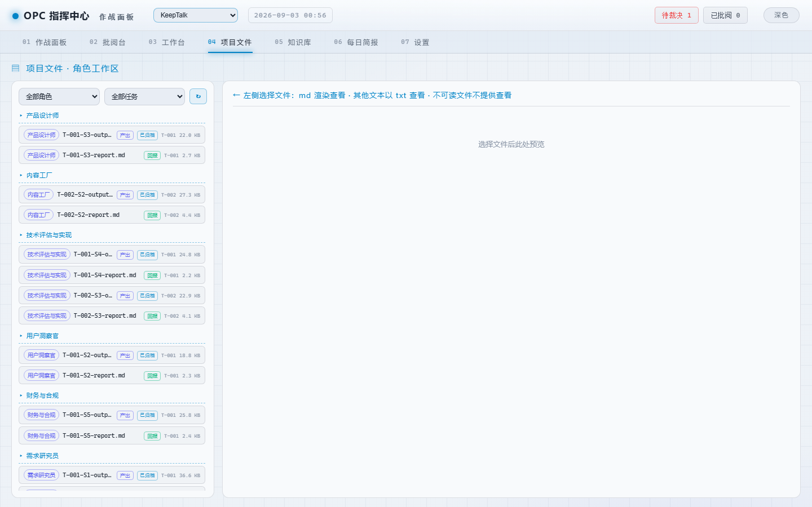

# OPC 智能体工作台（opc-web）

> 一人公司（One-Person Company）的日常指挥台：**浏览器打开 → 下达任务 → R1 拆解派发 → R2~R9 角色按职责产出 → R0 批阅、归档入库**。
> 控制台只负责「下达与记录」，执行交给常驻主会话 R1 与各角色 subagent —— 你自己当老板，AI 当员工。

[](https://www.python.org/)
[](pyproject.toml)
[](#快速开始)
[](#隐私与提交规范)
[](https://github.com/wenbuer/opc-web-dsh/stargazers)
[](LICENSE)

---

## 简介

一个人也能开一家公司：OPC 模式把「需求研究 → 内容生产 → 增长运营 → 用户洞察 → 数据分析 → 财务合规 → 产品设计 → 技术实现」拆给一套 **AI 角色体系（R0~R9）** 分工协作。opc-web 就是这家公司的**指挥入口**——纯本地的 Web 控制台，按「控制台 + 执行引擎」两层分工：

- **控制台本体（本项目）**：Python 3.9+ 纯标准库实现（`http.server` / `sqlite3`），**零 pip 第三方依赖**；只做下达、拆解、台账、批阅、归档与展示，只监听 `127.0.0.1`；
- **执行引擎 = DSH（DeepSeek Harness）**：任务拆解由控制台调用 `dsh --profile headless` 直跑，角色拆解与 subagent 派发由 **dsh 常驻主会话 R1** 承担——没有 dsh，控制台只能记账，跑不了任务闭环。

配合方式：

- 你只负责**拍板**：下达任务、批阅角色回报、归档决策；
- R1（老板助理，dsh 常驻主会话）负责**调度**：读台账 / 调度日志 → 拆子任务 → 用 subagent 逐个派发给对应角色；
- R2~R9 负责**干活**：产出写进各自工作区，回报回传台账；
- 状态走 SQLite 台账，正文走 md 公文，全部落本机目录，**不上云、不出网**。

> 一句话：**控制台下达，R1 拆解，角色执行，R0 把关。**

---

## 预览

<p align="center">
  
  <br>
  <em>图 1：作战面板（首页）——左侧 R0/R1/R2+ 组织架构，点击角色卡右侧展示角色卡全文与工作区产物，底部为项目时间线。</em>
</p>

<p align="center">
  
  <br>
  <em>图 2：工作台——输入任务点击「▶ 下达」，R1 自动拆解为子任务看板，右侧聚合执行历史、回报与产物，底部滚动 R1 实时事件。</em>
</p>

<p align="center">
  
  <br>
  <em>图 3：批阅台——左侧待裁决 / 例行工作文件，右侧展开决策项（项目整体进展 · 要拍板什么 · R1 建议），R0 以裁决签批准、驳回或修改。</em>
</p>

<p align="center">
  
  <br>
  <em>图 4：项目文件——左侧按 角色 / 任务 筛选各角色工作区产物，右侧 md 直接渲染、其他文本以 txt 预览；二进制 / 不可解码 / 超限文件不提供在线预览。</em>
</p>

---

## 特性

- **一套 AI 角色体系**：R0 创始人（拍板）→ R1 老板助理（枢纽调度）→ R2~R9 业务角色（需求研究 / 内容工厂 / 增长运营 / 用户洞察 / 数据分析 / 财务合规 / 产品设计 / 技术评估），支持在界面直接 **新增 / 编辑 / 删除** 角色，自动编号 R10+。
- **控制台零 pip 依赖，执行由 DSH 驱动**：控制台本体 Python 标准库实现（无第三方包），`python run.py` 即起、只监听 `127.0.0.1`、凭据只写本地 `.env`；任务拆解走 `dsh --profile headless`，角色派发由 dsh 常驻主会话 R1 用 subagent 完成。
- **七个工作视图**：作战面板 / 批阅台 / 工作台 / 项目文件 / 知识库 / 每日简报 / 设置，一条浏览器标签页管完「下达 → 执行 → 批阅 → 归档」闭环。
- **R1 自动拆解派发，宁少勿多**：拆解提示带各角色职责供模型按职能选人；任务开头点名（如「R8 …」）直派、指定 R1 牵头也能识别；能由一个角色一次完成的就只拆 1 个，确需多职能并行 / 接力才拆多个（上限 `maxSubtasks`）。
- **智能任务看板**：子任务按状态四列展示（待派 / 执行中 / 已完成 / 已归档），支持搜索、按任务筛选执行角色、点击任务行 / 看板卡片聚合全程输出，点单个子任务直接回看产出全文。
- **公文式批阅台 + 决策闭环**：待决条目只放「项目整体进展 / 需要 R0 拍板什么 / R1 建议」，「拍板什么」自动从角色回报的「需要 R0 拍板」小节抽取具体决策点（自动剔除「请 R0 裁决 / 驳回将重新派发」类空话，没写明则回退任务原话）；R0 盖**批准**章 → 控制台自动新建「执行 R0 决策」任务交 R1 派发执行，并把「R1 执行」状态回填进归档条目；**驳回 / 修改** → 不自动建任务，执行角色按批注补写或调整后重新回报。
- **Token 用量统计**：子任务 headless 执行时把 dsh 用量（输入含缓存读取 / 输出 / 缓存读取 / 推理）写回各自 `.meta.json`，设置页 Token 统计按任务聚合并展示——执行成本摊到明面上。
- **产出文件规范化命名**：执行中的子任务交付物 = `工作区/<角色>/T-001-S1-report.md`（完成回报，进度可边做边追加）；归档时自动改名 `-output.md` 连元数据移入 `工作区/<角色>/已归档/`；R1 任务汇总 = `T-xxx-summary.md`，历史旧命名自动迁移。
- **定时任务**：每天 / 每周 / 每隔 N 分钟三种模式，到点自动落台账生成调度指令，与手动下达走同一条 R1 执行链路，支持启停 / 删除。
- **知识库沉淀**：决策日志、调度记录、知识档案等统一归档维护，R1 汇总生成每日简报，知识随项目走不散落。
- **状态与正文分层存储**：任务 / 子任务 / 回报状态在 SQLite（唯一真相），正文与公文仍是人读人写的 md（旧文件混合编码容错读取），md 不再当数据库用。

---

## 目录

- [快速开始](#快速开始)
- [界面导览](#界面导览)
- [R0 批阅与决策闭环](#r0-批阅与决策闭环)
- [一条完整任务怎么走](#一条完整任务怎么走)
- [模型接入](#模型接入)
- [定时任务](#定时任务)
- [配置与数据](#配置与数据)
- [开发与测试](#开发与测试)
- [隐私与提交规范](#隐私与提交规范)
- [支持与致谢](#支持与致谢)
- [许可证](#许可证)

---

## 快速开始

**环境要求**：Python 3.9+；已安装 **DSH**（DeepSeek Harness，`dsh` 在 PATH 上——任务拆解会调用 `dsh --profile headless`）。

```bash
# 方式一：命令行启动（推荐）
python run.py

# 方式二：Windows 双击「启动控制台.bat」（自动开浏览器）
```

1. 启动后浏览器访问 **http://127.0.0.1:8901**（端口可在 `opc-config.json` 修改）；
2. 首次启动自动生成 `批阅台/`（公文 + SQLite 台账）、`工作区/<角色名称>/`、`知识库/` 三个目录与骨架文件，无需手动创建；
3. 在「设置 → 模型接入」填入大模型 API Key——R1 / 角色依赖它调用模型；
4. **开一个 dsh 常驻主会话（R1 助理）**：按 `agents-seed/R1.role.md` 装载角色并保持在线，它读取台账 / 调度日志并用 subagent 承接派发；
5. 去「作战面板」或「工作台」下达第一个任务试试。

---

## 界面导览

| 视图 | 干什么 | 要点 |
|---|---|---|
| **01 作战面板** | 看组织、看角色、下达任务 | 组织架构树（R0 → R1 → R2+）；点击角色卡看角色卡全文 + 工作区产物；新增 / 编辑 / 删除角色均在此 |
| **02 批阅台** | R0 把关 | 左侧 待裁决 / 例行工作 文件；右侧展开决策项，批准 / 驳回 / 修改（批准自动建执行任务，见[决策闭环](#r0-批阅与决策闭环)）；已批阅归档可回看 |
| **03 工作台** | 全程跟踪 | 下达任务、任务列表、子任务四列看板、任务输出聚合（执行历史 / 回报 / 产物 / 调度日志）、实时事件滚动 |
| **04 项目文件** | 各角色工作区 | 按 角色 / 任务 筛选文件；md 渲染查看、其他文本 txt 预览；二进制 / 不可解码 / 超 3 MB 不放行在线预览 |
| **05 知识库** | 档案阅读 | 知识库根平铺展示档案，有子目录自动分组；点击查看全文，R1 维护、角色只读 |
| **06 每日简报** | 每天一读 | 阅读《批阅台/每日简报-*.md》，R1 汇总产出 |
| **07 设置** | 目录 / 模型 / 定时 / Token | 项目根目录与端口；模型接入；定时任务；Token 统计（按任务聚合输入 / 输出用量） |

---

## R0 批阅与决策闭环

角色完成子任务后，回报进入批阅台成为**待决条目**。R0 的批阅不只是「看过」，而是直接驱动下一步执行：

1. **条目只放决策要看的**：项目整体进展、**需要 R0 拍板什么**、R1 建议（逐角色一段摘要，不再只有最后一份回报的压缩版）。
2. **「拍板什么」落具体内容**：从角色回报的「需要 R0 拍板」小节自动截取原文（剔除「任务含决策信号 / 请 R0 裁决 / 驳回将触发重新派发」这类流程空话）；角色没写明则回退到你下达任务时的原话——**绝不把机制套话写进待决**。
3. **裁决生效方式**：R0 以裁决签选 **批准 / 驳回 / 修改** 并附批语。
   - **批准** → 控制台立即在任务队列新建「执行 R0 决策（待决 #N）：<你的批语>」任务并生成派发指令，走与下达任务完全相同的 R1 拆解派发链路；该待决条目的归档区自动回填「R1 执行：已建任务 T-xxx」。
   - **驳回 / 修改** → 不自动建新任务：让执行角色按批注补写「现状背景 → 可选方案 → 建议」，或你在批注里直接给出裁决口径。
4. **归档可回看**：已批阅条目保留 R0 决策（裁决词 + 批语）与 R1 执行状态，工作台任务详情可回溯整条链。

---

## 一条完整任务怎么走

以 `R3 以内容工厂身份把本周产品动态整理进《知识库索引》` 为例：

1. **下达**：作战面板 / 工作台提交任务 → 任务落台账 T-001（待派）；
2. **拆解**：控制台调用 dsh headless 拆解（能单角色一次完成就只拆 1 个，确需并行才拆多个，上限 `maxSubtasks`）→ 子任务 T-001-S1… 落台账，预置交付文件 `工作区/内容工厂/T-001-S1-report.md` 与元数据 `T-001-S1.meta.json`，并把【派发单执行指令】写入《调度日志》；
3. **派发**：常驻主会话 R1 读取指令 → 逐个 subagent 派发给对应角色；控制台的自动执行链也会逐个子任务 headless 直跑——两条路都只把完成回报写进该子任务自己的 `-report.md`，互不覆盖；
4. **执行回报**：角色 / headless 把进度边做边追加进 `T-001-S1-report.md`，完成后把 `.meta.json` 的 `status` 置为 完成 / 部分 / 阻塞；自动执行还会把当次 token 用量一并写回 meta；
5. **汇总批阅**：R1 汇总各子任务回报生成 `工作区/老板助理（枢纽）/T-001-summary.md` 并整理成待决条目 → R0 在批阅台裁决（见[决策闭环](#r0-批阅与决策闭环)）——批准即自动新建「执行 R0 决策」任务继续派发；
6. **归档**：控制台把已完成子任务的 `-report.md` 改名 `-output.md`、连同 `.meta.json` 移入 `工作区/内容工厂/已归档/`，回报入库，子任务全完成时任务自动置「完成」；工作台任务详情可回看全程，设置页可看每任务 token 用量。

---

## 模型接入

设置 → 模型接入：

1. 选提供方：DeepSeek / OpenAI / Anthropic / 自定义；
2. 填 API Key —— **只写入项目根 `.env`**，不落配置明文、不回显、不入库；
3. baseURL / 模型可按需覆盖（留空用提供方默认）；
4. 点「测试连通」发 1 token 真实请求校验密钥。

接入后，dsh 会话与所有角色 subagent 自动继承同一凭据（惯例同 dsh 模型 API：提供方 → `<PROVIDER>_API_KEY` 环境变量）。

---

## 定时任务

设置 → 定时任务：

- **模式**：每天（固定时刻）/ 每周（星期几 + 时刻）/ 每隔 N 分钟；
- **内容**：填写任务指令（写法同下达任务），到点自动落台账并生成调度指令 → 走与手动下达完全相同的 R1 执行链路；
- 列表可随时**停用 / 启用 / 删除**，下次触发时间实时显示。

---

## 配置与数据

**配置优先级：环境变量 > `opc-config.json` > 默认值。** 配置文件不入库。

### `opc-config.json` 字段

| 字段 | 默认 | 设置页可改 | 生效 | 说明 |
|---|---|---|---|---|
| `root` | 项目根 | ✅ | 保存即生效 | 总根目录，其下自动建 批阅台/工作区/知识库 |
| `port` | `8901` | ✅ | **需重启** | 监听端口（socket 已绑定，改后必须重启） |
| `model` | — | ✅ | 保存即生效 | `{provider, apiKeyEnv?, baseURL?, model?}`；**密钥不写这里** |
| `schedule` | `[]` | ✅ | 保存即生效 | 定时任务列表 |
| `pollSeconds` | `8` | ❌ 手改 | 即时 | 调度守护轮询间隔（秒） |
| `decomposeTimeout` | `480` | ❌ 手改 | 即时 | 拆解任务 headless 无输出超时（秒），模型慢就调大 |
| `maxSubtasks` | `2` | ❌ 手改 | 即时 | 单个任务最多拆成几个并行子任务（模型拆解宁少勿多，此为硬上限） |

> 后三项是调优旋钮，刻意不进设置页 UI；手改 `opc-config.json` 即时生效，设置页保存不会覆盖手改字段（写入走「读盘 → 合并 → 写盘」）。

### 环境变量

| 变量 | 覆盖 |
|---|---|
| `OPC_CONFIG` | 配置文件路径（默认项目根 `opc-config.json`） |
| `OPC_KB_ROOT` | 知识库根目录（优先于 `root`） |
| `OPC_PORT` | 端口（优先于 `port`） |

### 数据落地

| 项 | 说明 |
|---|---|
| 凭据 | 只写项目根 `.env` 的 `<PROVIDER>_API_KEY`；不进 `opc-config.json`、不回显 |
| 状态台账 | `批阅台/opc.db`（SQLite，标准库 `sqlite3`）：任务 / 子任务 / 回报三张表，唯一真相；仅控制台进程写入 |
| 子任务元数据 | `工作区/<角色>/T-xxx-Sn.meta.json`：状态（子 agent 回填）+ 执行 token 用量（自动执行时写入），设置页汇总展示 |
| 运行数据 | 批阅台 / 工作区 / 知识库 由启动时自动生成 / 幂等重建，**不入库**，仓库保持干净 |
| 角色定义 | `agents/R?.role.md` 随项目分发；派发时把角色卡全文注入子 agent 的 prompt |
| 监听地址 | 固定 `127.0.0.1`（仅本机可访问，无配置开关） |

---

## 开发与测试

- 环境：Python 3.9+，控制台零 pip 依赖（标准库 `http.server` / `sqlite3`）；执行闭环需 dsh（见[快速开始](#快速开始)）；
- 角色管理 CLI：`python -m opc_web roles list | add --name … --duty …`；
- 运行测试：

```bash
python -m unittest discover -s tests -v
```

- 工程结构：标准 src 布局，包 `src/opc_web/`（config / server / scheduler / chain / roles / review / store / agent / bootstrap …），入口 `python run.py` 或 `python -m opc_web`（等价 `opc-web` 命令）。

---

## 隐私与提交规范

上传 GitHub 前，以下内容默认**不提交**（已列入 `.gitignore`）：

- `.env` —— 大模型 API 密钥（**绝对不要提交**）；
- `opc-config.json` —— 本机运行配置（root / port）；
- `批阅台/ 工作区/ 知识库/` —— 运行数据与业务内容。

其他规范：

- 提交前检查 `git status`：只应出现源码与文档（src/、templates/、static/、agents-seed/、tests/、run.py、pyproject.toml、README.md 等）；
- 预览图统一放 `images/` 并用**相对路径**引用（如 `images/opc-command-center-01.png`），不引绝对路径或盘符路径，迁移后依然可显示；
- 不用在仓库里提交本机临时脚本 / 调试产物（运行时日志、事件转储等）。

---

## 支持与致谢

如果你觉得 opc-web 好用，欢迎在仓库右上角**点一个 ⭐ Star**——让更多「一人公司」和独立开发者看到它，就是最好的支持：

<p align="center">
  <a href="https://github.com/wenbuer/opc-web-dsh/stargazers">
    
  </a>
</p>

如果这个项目对你有帮助，或是让你不用从零开发自己的 AI 员工团队，也欢迎请作者喝杯咖啡 ☕——每一份支持都会用于持续的维护与新功能：

<p align="center">
  
  &nbsp;&nbsp;&nbsp;&nbsp;
  
</p>

---

## 许可证

[MIT License](LICENSE)
